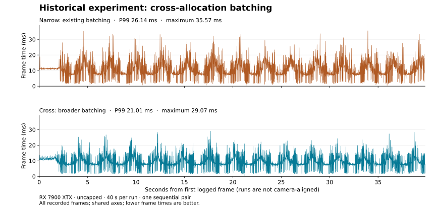
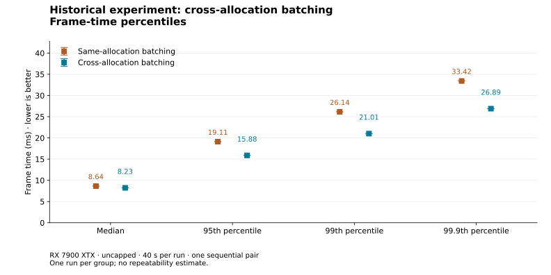

# Historical example: cross-allocation batching

**This measures one development step, not the complete patch set or the public
package.** Both modes already had scalar direct replacement and limited
batching. The treatment broadened eligible batching to replacements across
allocations. Neither mode is an unpatched driver.

These are the complete per-frame intervals from one sequential, uncapped
40-second pair in the same game process. The CPU was a Ryzen 9 9950X3D and GPU a
Radeon RX 7900 XTX, using native Wine Wayland. Both runs used the same E07 kernel,
E05 private RADV binary, saved game settings and display geometry. The user had
reported 50% minimum/maximum scaling and Low textures during this phase; live
internal dimensions were not measured. The 4K output dimensions are not a claim
of native-4K rendering. Both runs retained the 6000/5000 MB streaming pool INI
settings.

The narrow run preceded the cross run. Camera motion was manual; there was no
uncapped return control or set of repeated pairs. Order, warming and workload
variation limit the effect-size interpretation. These graphs cannot quantify
the improvement of the final setup at 100% scaling.





| Measurement | Same-allocation batching | Cross-allocation batching |
| --- | ---: | ---: |
| Frames | 3,976 | 4,396 |
| Sum of frame intervals | 39.810 s | 39.869 s |
| Average FPS | 99.875 | 110.260 |
| P95 frame time | 19.105 ms | 15.879 ms |
| P99 frame time | 26.144 ms | 21.011 ms |
| P99.9 frame time | 33.423 ms | 26.892 ms |
| Maximum | 35.567 ms | 29.069 ms |
| Frames over 25 ms | 49 | 10 |
| Frames over 33.333 ms | 6 | 0 |

`narrow.csv` and `cross.csv` preserve every original elapsed timestamp and frame
interval, in the original order and decimal representation. Other telemetry
columns and the hardware header were removed. Source archive and original CSV
SHA-256 hashes are in `manifest.json`; hashes of these reduced CSVs are included
in `graphs/metrics.json`. No frame samples were removed, smoothed or rescaled.

From the repository root:

```sh
python3 benchmarks/plot.py benchmarks/examples/e07/manifest.json \
  --output benchmarks/examples/e07/graphs
```

The plotter's output matches the earlier independent analysis. MangoHud logs
application frame intervals; these are not measurements of physical scanout.
