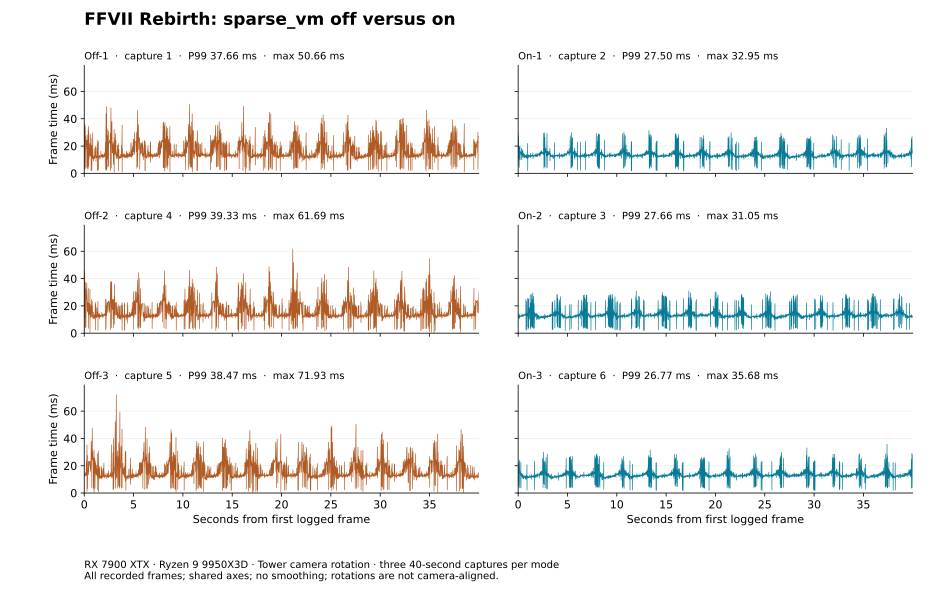
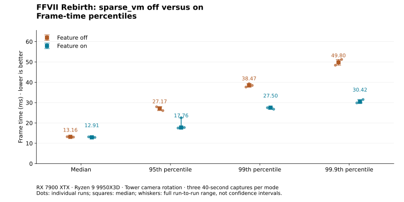

# Packaged feature comparison — RX 7900 XTX

Recorded on 30 September 2026. This compares **the same installed kernel and
RADV with `RADV_EXPERIMENTAL=sparse_vm` absent and present**. It measures the
packaged feature, not a swap between stock and patched distribution binaries.

Across three approximately 40-second captures per mode, median average FPS
increased from **64.9 to 74.9 (+15.4%)**. Median P99 frame time decreased from
**38.47 to 27.50 ms (28.5% lower)**; P99.9 decreased from **49.80 to 30.42 ms
(38.9% lower)**. Frames longer than 33.333 ms numbered **189 off versus 1 on**
over approximately 120 seconds per mode. These are counts of long frames,
not individual stutter events.





## Every run

Rows follow acquisition order. All frames are included, including each run's
first and last frame. No run, interval or outlier has been removed.

| Capture | Mode/run | Average FPS ↑ | P95 ms ↓ | P99 ms ↓ | P99.9 ms ↓ | Maximum ms ↓ | Frames >33.333 ms ↓ |
| --- | --- | ---: | ---: | ---: | ---: | ---: | ---: |
| 1 | Off 1 | 64.78 | 27.95 | 37.66 | 48.40 | 50.66 | 61 |
| 2 | On 1 | 73.71 | 17.51 | 27.50 | 29.85 | 32.95 | 0 |
| 3 | On 2 | 74.92 | 22.55 | 27.66 | 30.42 | 31.05 | 0 |
| 4 | Off 2 | 64.90 | 27.17 | 39.33 | 49.80 | 61.69 | 63 |
| 5 | Off 3 | 65.66 | 26.08 | 38.47 | 51.23 | 71.93 | 65 |
| 6 | On 3 | 75.08 | 17.76 | 26.77 | 31.53 | 35.68 | 1 |

The FPS and percentile comparisons use the median of three **per-run** metrics.
Frames are not pooled to calculate percentiles. The off runs contain 7,812
frames over 119.981 seconds; the on runs contain 8,947 over 119.982 seconds.
Individual frame counts and durations are in [metrics.json](graphs/metrics.json).

## Setup and matching checks

| Item | Recorded setup |
| --- | --- |
| Hardware | Radeon RX 7900 XTX, Ryzen 9 9950X3D, 128 GB RAM |
| Kernel | `7.2.8-2-cachyos-sparse-vm` |
| Packages | `linux-cachyos-sparse-vm 7.2.8-2`, `vulkan-radeon-sparse-vm 3:26.2.3-2`, `mangohud 0.8.4-1.1` |
| Display path | Native Wine Wayland; HDR enabled in the recorded environment and saved settings |
| Run note | Grasslands/Wastelands Tower rotation; 3840×2160, 100% scaling, high textures, `t.MaxFPS 0` |
| Saved window dimensions | 3840×2134 in every capture; live render extent was not independently measured |
| Retained INI overrides | `r.Streaming.PoolSize=6000`, `r.Streaming.MassiveEnvironmentPoolSizeMB=5000` in both modes |
| Procedure | Fresh game launch per capture; automatic warm-up of at least 30 seconds, then 40 seconds of per-frame MangoHud logging |
| Order | Off 1 → On 1 → On 2 → Off 2 → Off 3 → On 3 |

All six captures completed. The collector's hash matches the published code at
`b48c29ca15a1cfbf6ab375cb951a4d07b1517e09`. They share the same boot, package
versions and loaded game, Wine, D3D12, RADV and MangoHud binary hashes.
The mapped RADV hash matches the installed library. Activation was confirmed
in all on runs and absent in all off runs. In the selected graphics environment
fields, only `RADV_EXPERIMENTAL` differs. No queue profiling was enabled there.

The before/after snapshots match within every capture. The saved gameplay INI
hashes match across all six captures. The only configuration-file additions
between runs are crash-report-client entries, discussed below. CSV hashes,
durations, timestamp consistency and the reported metrics were checked; FPS
and quantiles were also recomputed independently. Source hashes and reviewed
metadata are in [provenance.json](provenance.json).

## Limits and stability

This is one scene on one GPU, with three runs per mode and manual camera
rotation. Runs are not aligned to the same camera angle at each timestamp.
The reported graphics settings are the operator's notes; the saved window
height differs from the reported output height. No live-resolution measurement
or settings screenshot accompanies these archives. Frame-generation state and
the exact Proton package version were not independently recorded, although the
captured Wine/D3D12 binaries match across all runs.

MangoHud measures application-side frame intervals, not physical display
scanout. Variation bars show the observed minimum and maximum across runs,
not confidence intervals. The feature still has some long frames; these
measurements do not establish stutter-free play, performance on other GPUs,
or the effect of removing the retained INI overrides.

All six measured windows completed. In a follow-up, the tester reported no
noticed crashes or gameplay interruptions during these runs. Five new
`CrashReportClient` configuration entries appeared between captures, following
both off and on runs. Those entries alone do not establish a gameplay crash;
the reports themselves and kernel fault logs are absent, so their cause is
unknown. These short captures do not establish long-term stability, verify
shutdown behaviour or replace the public package's native GPU tests.

## Reproduce the figures

From the repository root, with Python and Matplotlib installed:

```sh
python3 benchmarks/plot.py benchmarks/results/2026-09-30-rx7900xtx/manifest.json \
  --output benchmarks/results/2026-09-30-rx7900xtx/graphs
```

The six CSV files retain every original `elapsed` and `frametime` decimal
string, in order, under the clearer column names `elapsed_ns` and
`frametime_ms`. Unrelated metadata and telemetry columns have been removed.
There is no smoothing, trimming, resampling or outlier rejection.

Average FPS is frame count divided by the sum of frame intervals. Percentiles
use linear interpolation. The threshold shown as 33.333 ms is exactly
`100 / 3` ms in the calculations. [summary.json](summary.json) contains the
per-mode medians, ranges and long-frame totals; [manifest.json](manifest.json)
lists all runs in acquisition order. SVG and PNG versions are supplied.
